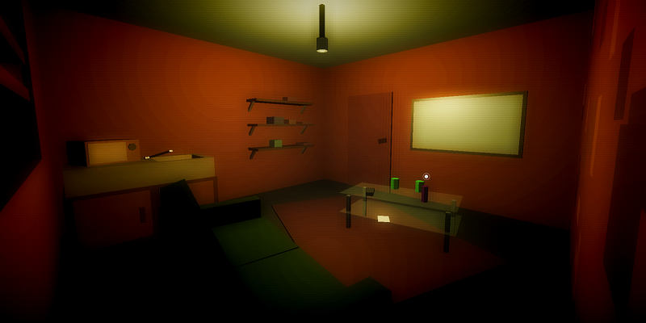

Room
====

A THREE.js solo school project made within 2 weeks.

**[Live version here](https://room.edhbr.fr/)**

## Install
With NPM :
- Run `npm i`
- Run `gulp` (gulp-cli required)

Without NPM :
- Just run index.html in `dev/` (local server may be needed on chromium based browser)

## Features

- First person view
- Discover memory about furnitures and object
- Random room generation (at some level)
- Day / Night cycle
- Multi-ending according to the memory you discovered while exploring (coming soon!)
- Keyboard binding choice (coming soon!)

## Tech
- Front:
  - HTML
  - CSS
  - JS
- Libraries:
  - [THREE.js](https://threejs.org/) (webGL)
  - [Pizzicato.js](https://alemangui.github.io/pizzicato/) (audio)
  - [Cursor.js](https://github.com/edhbr/bin-brary) (cursor), a personnal library
- Development:
  - Gulp

## Credits
- Musics from [The Stanley Parable](https://fr.wikipedia.org/wiki/The_Stanley_Parable) by The Blake Robinson Synthetic Orchestra:
  - [Website](http://syntheticorchestra.com/)
  - [Bandcamp](http://blake.so/bandcamp)
  - [Youtube](http://youtube.com/SyntheticOrchestra)

## Benchmarks

- Windows:
  - Desktop with **GTX 1070** & 16Go RAM:
    - Chrome: ~60fps, constant
    - Firefox: ~60fps, constant
  - Laptop with **GTX 1050** & 16Go RAM:
    - Chrome: ~60fps, constant
    - Firefox: ~55fps, constant
  - Laptop with **GTX 950M** & 16Go RAM:
    - Chrome: ~40fps, constant
  - Desktop with **AMD RADEON HD 5450 (2010)** & 2Go RAM:
    - Chrome: ~25fps, inconstant
    - Firefox: ~20fps, inconstant

- Mac OS:
  - MBP13 2013 with **Intel Iris 5100** & 8Go RAM:
    - Chrome: ~35fps, iconstant
  - MBP15 2015 with **AMD RADEON R9370X** & 16Go RAM:
    - Chrome: ~60fps, constant

## Gallery

