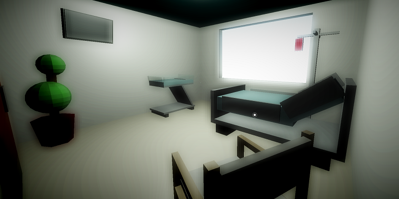
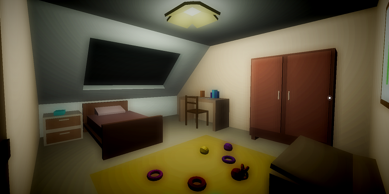
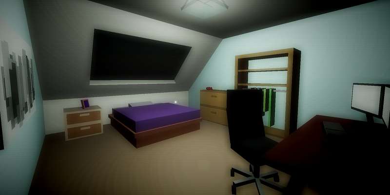

Room
====

A THREE.js solo school project made within 2 weeks.

**[Live version here](https://room.edhbr.fr/)**

## Note (**important, must read**)
It was a fun project to make, performances should be ok (fps button can increase performances by turning off most shaders).

There're 3 differents ending right now according to what you furnitures / object you clicked on (only bad ending at the moment, please do not draw hasty morals), here's how to access each of them (spoiler alert) :
- **Homeless ending**: Just get through rooms, don't click on post-it or paper when on squat room (see below).
- **Incarceration ending**: Click on the left screen on student room then click on the post-it on the door in squat room OR just click on the paper under the transparent table in squat room.
- **Light ending**: Click on the room's lights of the hospital room, child room, student room and of the squat room (if you click on too many other furnitures you wont be able to access light ending, max. 8 more excluding lights and doors).

## Install
With NPM:
- Run `npm i`
- Run `gulp` (gulp-cli required)

> Note: I came accross some bug with npm recently but `npm i` and `gulp` should still run fine.

Without NPM:
- Just run index.html in `dev/` (local server may be needed on chromium based browser)

## Features

- 7 unique rooms
- THREE.js shaders to enhance scene render

- Environment:
  - Random date generation
  - Next room according to what you have discovered
  - Some randomness in each room generation
  - Day / Night cycle
- Gemaplay:
  - Discover memory about furnitures and object by clicking on it when they are outlined
  - Multi-ending according to the memory you discovered while exploring
  - First person view
  - WASD, ZQSD and keyboard arrow controls
  - Sounds output control button
  - Toggle shaders button to improve performances
- Accessibility:
  - Need to be played on a device with a keyboard and a mouse / trackpad (not enought time to craft a mobile friendly way to play)
  - Message if mobile to tell user to use app on a computer
  - Timeout on sounds loading to let player play before sounds are load if connection to slow
  - Feature detection with Modernizr

## Tech
- Front:
  - HTML
  - CSS
  - JS
- Libraries:
  - [THREE.js](https://threejs.org/) (webGL)
  - [Pizzicato.js](https://alemangui.github.io/pizzicato/) (audio), overkill right now but planned to add sounds according to current room.
  - [Mordernizr.js](https://modernizr.com/) (compatibility)
- Development:
  - Gulp

## Credits
- Musics from [The Stanley Parable](https://fr.wikipedia.org/wiki/The_Stanley_Parable) by The Blake Robinson Synthetic Orchestra:
  - [Website](http://syntheticorchestra.com/)
  - [Bandcamp](http://blake.so/bandcamp)
  - [Youtube](http://youtube.com/SyntheticOrchestra)

## Benchmarks

- Windows:
  - Desktop with **GTX 1070** & 16Go RAM:
    - Chrome: ~60fps, constant
    - Firefox: ~60fps, constant
  - Laptop with **GTX 1050** & 16Go RAM:
    - Chrome: ~60fps, constant
    - Firefox: ~55fps, constant
  - Laptop with **GTX 950M** & 16Go RAM:
    - Chrome: ~40fps, constant
  - Desktop with **AMD RADEON HD 5450 (2010)** & 2Go RAM:
    - Chrome: ~25fps, inconstant
    - Firefox: ~20fps, inconstant

- Mac OS:
  - MBP13 2013 with **Intel Iris 5100** & 8Go RAM:
    - Chrome: ~35fps, iconstant
  - MBP15 2015 with **AMD RADEON R9370X** & 16Go RAM:
    - Chrome: ~60fps, constant

## Gallery (first few rooms)

And three more rooms to find... (no spoil)
